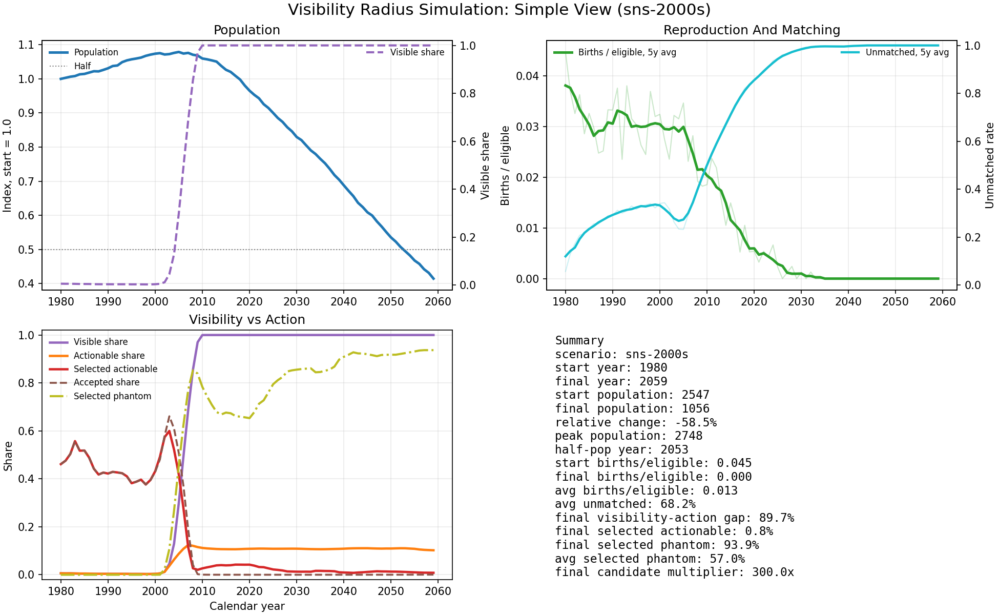
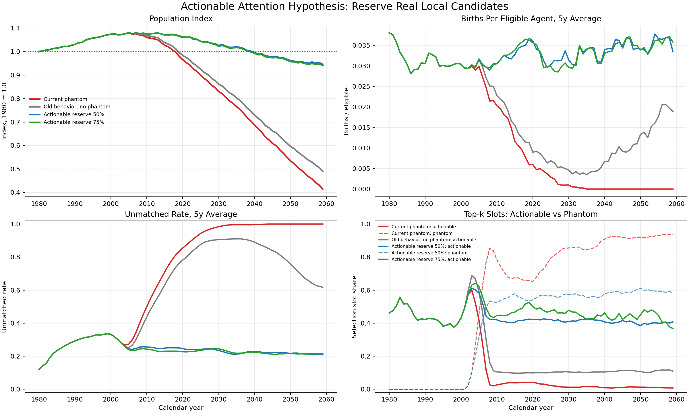
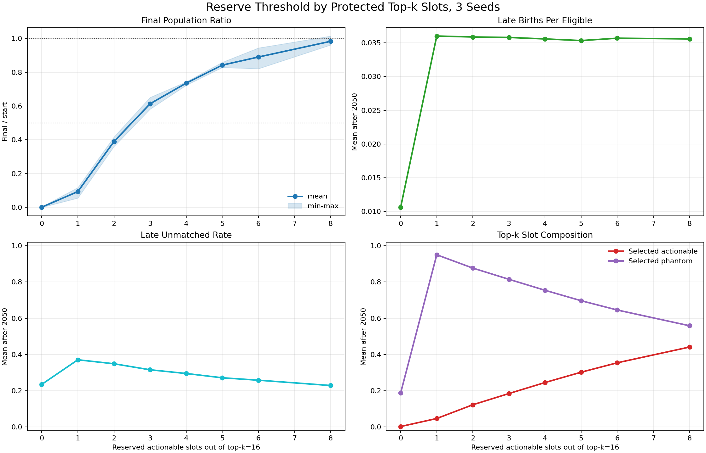
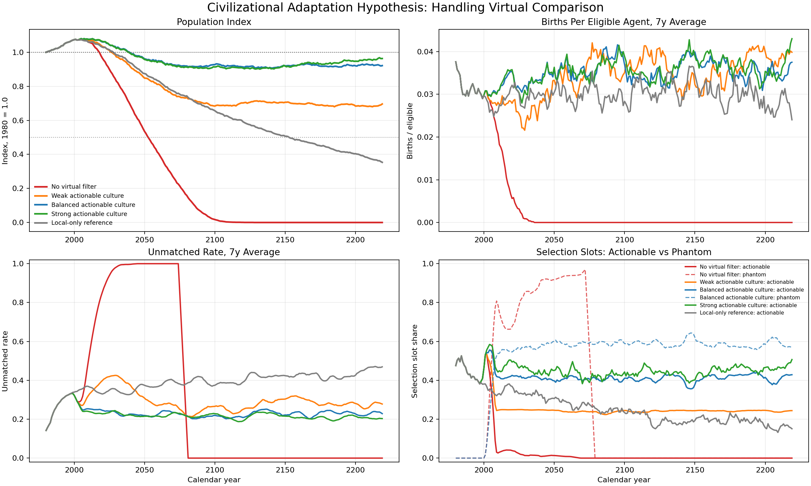
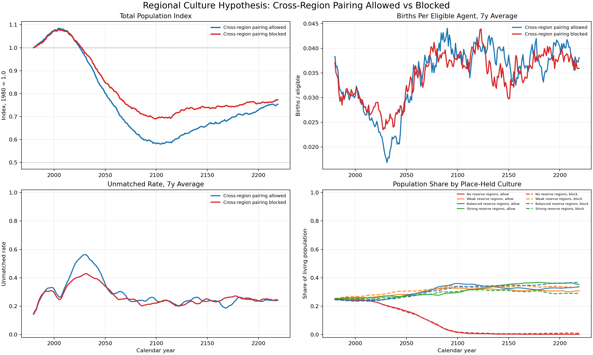
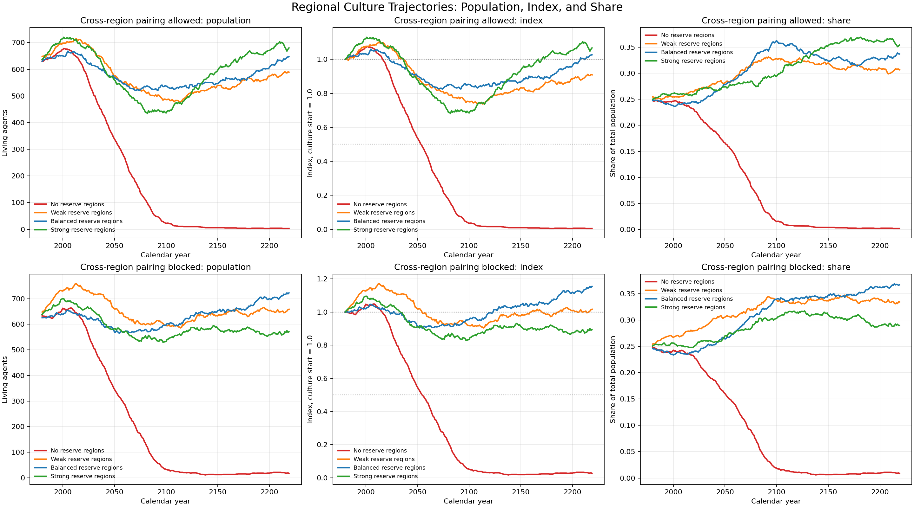
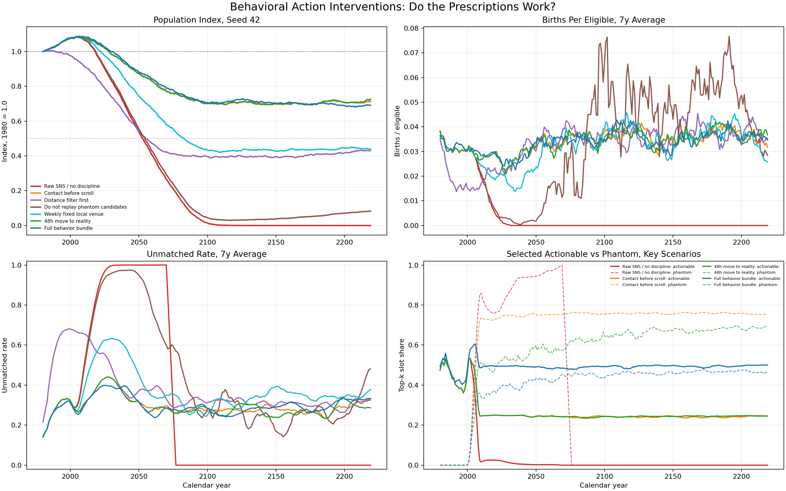

# Expanding Visibility, Bounded Attention, and Actionable Mate Choice

## A Working Paper from the Visibility Radius Simulation

Version: 0.1  
Date: 2026-06-05  
Repository: `visibility-radius-sim`

## Abstract

This working paper presents an abstract agent-based simulation of mate selection under rapidly expanding visibility radius. The model asks whether a local "top candidate selection" strategy remains adaptive when the observable candidate pool expands faster than the practical action radius. Agents evaluate candidates through bounded top-k attention. Some candidates are real and actionable; others are visible but effectively non-actionable, called phantom candidates. The central mechanism explored here is attention displacement: when phantom candidates consume top-k selection slots, mutually actionable pair formation can collapse even if local viable candidates still exist.

Across exploratory simulations, unrestricted global visibility with local action constraints produces severe demographic bottlenecks or extinction-like outcomes. However, reserving a fraction of attention for actionable candidates prevents collapse. The effect is threshold-like because top-k attention is discrete: with `top_k=16`, four to eight protected actionable slots are often enough to stabilize the system. Regional culture experiments suggest that place-held norms preserving actionable attention can survive while no-reserve regions are selected out. Behavioral intervention simulations further indicate that the most useful prescription is not simply "use SNS less", but rather: preserve real-world contact slots before virtual comparison begins.

The model is not a demographic forecast and does not claim to explain real human fertility directly. Its contribution is narrower: it provides a formal toy model for studying how candidate-pool expansion, bounded attention, and actionability constraints can interact.

## Keywords

agent-based model, visibility radius, mate selection, bounded attention, phantom candidates, actionable attention, reproductive concentration, cultural adaptation

## Figure List

- Figure 1: SNS 2000s baseline population trajectory
- Figure 2: Phantom candidates and actionable reserve comparison
- Figure 3: Actionable reserve protected-slot threshold
- Figure 4: Long-run cultural adaptation scenarios
- Figure 5: Region boundaries and culture trajectories
- Figure 6: Behavioral intervention scenarios

## 1. Motivation

Human-scale mate selection historically operated under strong locality constraints. The observable candidate pool was bounded by place, institutions, kinship, occupation, and repeated face-to-face interaction. Modern networked media changes this informational environment: a person can compare against a candidate pool many times larger than their practical ability to meet, form trust with, or coordinate with.

The motivating question is:

> Can a local top-candidate selection strategy remain adaptive when the observable candidate pool expands from local to global?

This question is not a claim that humans mechanically optimize mate choice, nor that fertility decline has a single cause. It is a modeling question about mismatch between three quantities:

- visibility radius: who can be seen or compared against
- action radius: who can realistically be met, trusted, coordinated with, or paired with
- attention capacity: how many candidates can occupy top-choice evaluation

The model explores what happens when visibility radius grows much faster than action radius.

## 2. Conceptual Hypothesis

The working hypothesis is:

> Rapid expansion of visible candidates can become maladaptive when attention remains top-k and action radius remains local.

The proposed failure mode is:

```text
global visibility + local action radius + bounded top-k attention
-> phantom candidates consume top-k slots
-> actionable mutual selection falls
-> pair formation falls
-> births fall
-> population viability weakens
```

The proposed countermeasure is not information abstinence by itself. The model instead predicts that survival depends on preserving enough actionable candidates inside the evaluation process.

In practical language:

> A society or individual does not need to eliminate virtual visibility. It must prevent non-actionable comparison from displacing all actionable courtship.

## 3. Model Summary

Each agent has:

- age
- lifespan
- location
- traits
- preference weights
- selectivity
- alive/dead status
- optional region identity

Traits are numeric vectors, such as attractiveness, resources, intelligence, kindness, and stability. Preference weights are numeric vectors of the same dimension.

Each simulated year:

1. Agents age.
2. Agents past lifespan die.
3. Visibility radius is updated.
4. Reproductively eligible agents evaluate candidates.
5. Candidates are scored using preference weights.
6. Selection is limited by percentile or top-k attention.
7. Pairs form only under mutual selection.
8. Matched pairs may produce children.
9. Children inherit parental traits with mutation noise.
10. Metrics are recorded.

The later experiments add four abstractions:

- `phantom_candidate_mode`: visible but non-pairable candidates can enter comparison.
- `action_radius`: only candidates inside this radius are actionable.
- `actionable_selection_reserve_fraction`: a share of top-k slots reserved for actionable candidates.
- regional cultures: place-held reserve fractions, used as a proxy for local norms or institutions.

## 4. Metrics

The main outputs are:

- population size and population index
- births per eligible agent
- matched pair count
- unmatched rate
- trait mean and variance
- trait diversity
- reproductive concentration
- effective parent count
- selected actionable share
- selected phantom share
- visibility radius and candidate-pool expansion

One caution is important: unmatched rate becomes misleading near collapse. When the eligible population becomes very small, a low unmatched rate can be a denominator artifact rather than recovery. For viability, population index and births per eligible are more informative.



Figure 1 shows the simplified SNS 2000s baseline trajectory. Later figures compare this collapse-like baseline against interventions that preserve actionable selection.

## 5. Main Experiments and Results

### 5.1 Phantom candidates make visibility expansion causal

Early versions of the model showed that candidate-pool expansion alone did not always change outcomes strongly. The reason was structural: if all scored candidates were pairable, then radius expansion mainly changed diagnostics.

Adding sampled phantom candidates changed this. A visible but non-actionable candidate can win attention and consume a top-k slot. This makes visibility radius causally relevant.

In the actionability comparison:

| Scenario | Final ratio | Late selected actionable | Late selected phantom |
|---|---:|---:|---:|
| Current phantom | 0.415 | 0.018 | 0.850 |
| Old behavior, no phantom | 0.491 | 0.106 | 0.000 |
| Actionable reserve 50% | 0.945 | 0.412 | 0.574 |
| Actionable reserve 75% | 0.941 | 0.455 | 0.535 |

The key result is not that phantom candidates are bad in a moral sense. The result is that a non-actionable comparison object can still consume scarce decision attention.



Figure 2 compares sampled phantom candidates against actionable reserve interventions. The viability difference is closely tied to whether actionable candidates remain inside top-k attention.

### 5.2 The collapse mechanism is attention displacement

The severe failure mode appears when global visibility is paired with local action. Agents can see a large pool, but they cannot pair with most of it. If selection is top-k, highly scored phantom candidates can crowd out the real local candidates needed for mutual pair formation.

This creates a model-level distinction between:

- preference formation: who looks best in the comparison pool
- pair formation: who can actually coordinate and reproduce

When those diverge too much, births collapse.

### 5.3 Actionable reserve has a threshold-like effect

The reserve mechanism protects part of top-k attention for real candidates within action radius. With `top_k=16`, reserve fractions become integer protected slots.

Multi-seed slot sweep:

| Protected actionable slots | Reserve fraction | Mean final ratio |
|---:|---:|---:|
| 0 | 0.0000 | 0.001 |
| 1 | 0.0625 | 0.094 |
| 2 | 0.1250 | 0.390 |
| 3 | 0.1875 | 0.613 |
| 4 | 0.2500 | 0.735 |
| 5 | 0.3125 | 0.842 |
| 6 | 0.3750 | 0.890 |
| 8 | 0.5000 | 0.983 |

This suggests that viability is not a smooth moral gradient from "weak discipline" to "strong discipline". It behaves more like an engineering threshold:



Figure 3 shows the threshold-like effect when reserve fraction is interpreted as protected top-k slots. With `top_k=16`, the major transition occurs around four to six protected actionable slots.

```text
enough actionable slots early enough to avoid a deep bottleneck
```

Once the system stays above that threshold, weak, balanced, and strong reserve cultures can all survive.

### 5.4 Place-held culture can preserve actionable attention

The regional experiments treat culture as a property of place rather than only a parent-child trait. This reflects the idea that norms are held by institutions, repeated local interaction, language, law, geography, and social expectation, not only by families.

Long-run fixed-culture comparison:

| Scenario | Final ratio | Late births / eligible | Late selected actionable |
|---|---:|---:|---:|
| No virtual filter | 0.000 | 0.0000 | 0.001 |
| Weak actionable culture | 0.696 | 0.0361 | 0.241 |
| Balanced actionable culture | 0.921 | 0.0357 | 0.410 |
| Strong actionable culture | 0.963 | 0.0362 | 0.443 |
| Local-only reference | 0.353 | 0.0301 | 0.214 |

This supports a cultural adaptation interpretation:



Figure 4 compares no correction, weak correction, balanced correction, strong correction, and a local-only reference over the long run. Once a correction passes the viability threshold, differences appear more in recovery depth and population share than in binary survival.

> Cultures that teach or enforce virtual-world resilience can survive the expanded visibility environment; cultures with no correction can be selected out.

However, the model does not imply that maximum restriction is always optimal. Above the survival threshold, additional reserve may change population share and recovery depth more than binary survival.

### 5.5 Region boundaries and cross-region pairing matter

Cross-region pairing changes how cultures mix. In the current regional comparison:

| Cross-region pairing | Final ratio | No-reserve share | Weak share | Balanced share | Strong share |
|---|---:|---:|---:|---:|---:|
| Allowed | 0.754 | 0.002 | 0.307 | 0.337 | 0.354 |
| Blocked | 0.774 | 0.009 | 0.335 | 0.367 | 0.290 |

The result is not yet robust enough to rank boundary policies. But it shows that boundaries affect culture share, not only total population. Allowing cross-region pairing can diffuse successful norms; blocking it can preserve regional composition. The optimal cultural strength likely depends on migration, pairing rules, and how fast norms spread.





Figure 5a and Figure 5b show how region boundaries affect both total population and culture share.

### 5.6 Behavioral interventions: what helps individuals?

A later experiment translated model mechanisms into concrete behavioral rules.

| Variant | Behavioral interpretation | Final ratio mean |
|---|---|---:|
| Raw SNS / no discipline | no intervention | 0.001 |
| Contact before scroll | reserve real-world contact before virtual comparison | 0.735 |
| 48h move to reality | move online interest into real contact quickly | 0.710 |
| Full behavior bundle | combine reserve, phantom cap, and larger action radius | 0.705 |
| Distance filter first | filter by locality before evaluation | 0.515 |
| Weekly fixed local venue | increase repeated local contact | 0.432 |
| Do not replay phantom candidates | reduce non-actionable comparison only | 0.067 |

The strongest result is:



Figure 6 compares behavioral interventions translated from the model mechanism. The strongest interventions preserve real-world contact slots before virtual comparison begins; reducing phantom replay alone is not enough.

> The useful intervention is not simply reducing SNS exposure. It is preserving real-world candidate slots before virtual comparison consumes attention.

In other words, "SNS for 30 minutes per day" is too indirect. Better action-level rules are:

- schedule real-world contact before browsing or scrolling
- filter for locality before ranking candidates
- move online interest toward real interaction quickly
- avoid storing non-actionable candidates as ongoing comparison standards
- participate in repeated local institutions where trust and coordination can accumulate

## 6. Interpretation

The model suggests that the problem is not visibility itself. Visibility can be useful. The problem appears when visibility expands without a corresponding expansion in actionability.

A high-visibility environment creates many comparison objects. But reproduction, trust, pair formation, and long-term coordination still require constraints:

- physical or logistical proximity
- repeated interaction
- shared expectations
- mutual availability
- timing
- social verification
- practical commitment pathways

If these are absent, more visibility may produce less pairing.

This leads to a compact interpretation:

```text
The adaptive unit is not "seeing more".
The adaptive unit is "converting enough attention into actionable mutual selection".
```

## 7. Practical Implications

### 7.1 For individuals

The model favors concrete sequencing rules over vague restraint.

Useful behaviors are:

- create real contact before comparison expands
- make locality a pre-filter, not an afterthought
- convert online interest into a real meeting or drop it
- do not let unreachable candidates become the reference set
- keep a small number of serious candidates under active coordination

The point is not moral purity or nostalgia. The point is preserving actionability inside bounded attention.

### 7.2 For platforms

If a platform wanted to support pair formation rather than endless comparison, it would optimize for conversion to actionable contact:

- local-first ranking
- mutual availability filters
- event-based matching
- small active candidate queues
- decay of stale or unreachable candidates
- friction against infinite browsing after a viable mutual match exists

The model predicts that platforms designed only for engagement can worsen attention displacement, while platforms designed for actionable transition may improve outcomes.

### 7.3 For communities and institutions

Communities can be interpreted as mechanisms that maintain actionable candidate pools:

- schools
- workplaces
- clubs
- neighborhoods
- introductions
- recurring events
- shared rituals
- local norms around commitment and availability

In the model, this is "place-held culture". It protects actionability without requiring each individual to solve the virtual comparison problem alone.

### 7.4 For policy and civic design

If the mechanism is correct, fertility support is not only a matter of subsidies. Economic constraints still matter, but social infrastructure matters too.

Potentially relevant interventions are:

- housing patterns that keep young adults near stable communities
- third places and recurring local events
- institutions that make introductions low-risk and normal
- transport and schedules that reduce coordination cost
- platform regulation or incentives around actionable matching

The model does not prove these policies will work. It suggests where to look.

## 8. What This Paper Does Not Claim

This model does not claim:

- that fertility decline is caused only by SNS
- that real people choose mates by numeric vectors
- that any specific culture is superior in a moral sense
- that local-only society is ideal
- that restricting information is always good
- that Japan or any country is directly simulated

The safer claim is:

> In a bounded-attention selection system, rapidly expanding non-actionable comparison can suppress real mutual pairing unless attention or institutions preserve actionability.

## 9. Limitations

The current model is intentionally simple.

Major limitations:

- no explicit economics
- no housing or labor-market constraints
- no sex/gender-specific reproductive biology
- no contraception or family planning
- no marriage institution
- no childcare cost
- no explicit learning except fixed cultural parameters
- no network topology beyond location and region
- no endogenous platform design
- no empirical calibration to real population data

The model should therefore be treated as a mechanism explorer, not a forecast.

## 10. Future Work

The next useful extensions are:

1. Add cultural learning at the region level.
2. Separate migration from cross-region pairing.
3. Add platform designs that optimize for actionability versus engagement.
4. Track trust and repeated interaction directly.
5. Add economic constraints as independent bottlenecks.
6. Calibrate stylized scenarios against real demographic series only after the mechanism is stable.
7. Run larger multi-seed sweeps across `top_k`, action radius, reserve fraction, and candidate-pool multiplier.

The most important next experiment is probably institutional learning:

```text
Can regions adapt their actionable reserve culture after observing demographic decline?
```

This would test whether civilization can recover without requiring every individual to consciously understand the mismatch.

## 11. Conclusion

The simulation supports a modest but potentially useful thesis:

> In environments of rapidly expanded visibility, survival depends less on suppressing information and more on preserving pathways from attention to action.

The model's strongest practical lesson is not "stop using SNS". It is:

> Do not let non-actionable comparison occupy all top-choice attention.

For individuals, that means sequencing virtual visibility after real-world contact, locality, and mutual availability. For platforms, it means designing for actionable transition rather than endless browsing. For communities, it means maintaining repeated local institutions where viable pair formation can occur without every agent needing to solve the global comparison problem alone.

If this mechanism generalizes, then a culture adapted to the virtual world is not one that rejects the virtual world. It is one that prevents the virtual world from breaking the bridge between desire, attention, and real coordination.

## Appendix Follow-Ups

After this working paper draft, seven follow-up experiments A-G were added.
Their outputs are bundled under `paper/appendix_followups/`.

The main updates are:

- Radius expansion alone is not the primary collapse mechanism; collapse is strongest when the actionability gap and phantom comparison interact.
- SNS-like pressure is better represented as perceived candidate-pool multiplier than as spatial distance alone.
- Top-k attention is fragile, but percentile selection alone is not enough to rescue viability.
- Expanding action radius alone does not defeat extreme phantom competition.
- Protected actionable-slot thresholds remain visible across `top_k=8,16,32,64`.
- This version does not yet show an overconstraint penalty for very strong reserve culture.
- Region-level institutional learning can substantially mitigate collapse if it adapts early and strongly enough.

These follow-ups sharpen the paper's claim from "radius expansion is bad" to:

```text
non-actionable comparison is dangerous when it occupies bounded attention,
and viability depends on protected actionable slots or institutional learning.
```

## Reproducibility Notes

Primary outputs used:

- `data/actionable_attention_comparison_summary.csv`
- `data/civilizational_adaptation_longrun_summary.csv`
- `data/regional_culture_crossing_summary.csv`
- `data/reserve_threshold_slots_multiseed_summary.csv`
- `data/behavioral_action_interventions_summary.csv`
- `data/behavioral_action_interventions_seed42_summary.csv`
- `appendix_followups/data/appendix_followups_summary.csv`

Figures are bundled under `figures/`.

Representative commands:

```bash
uv run python -m visibility_radius_sim.cli run --years 50 --population 300 --output outputs/demo.csv
uv run python -m visibility_radius_sim.cli plot --input outputs/demo.csv --output outputs/demo.png
uv run pytest
```

Many exploratory outputs were generated by ad hoc scenario scripts in the working session. For publication-grade reproducibility, those scripts should be promoted into versioned CLI subcommands or notebooks.
